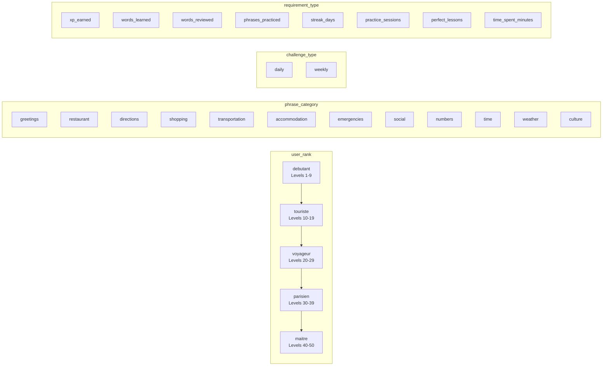
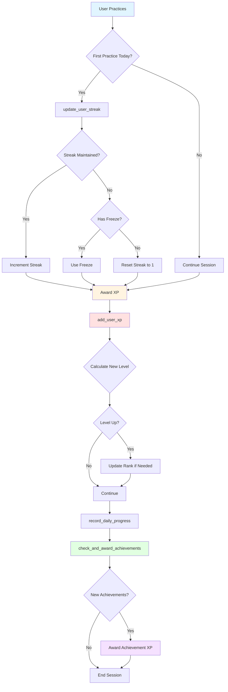
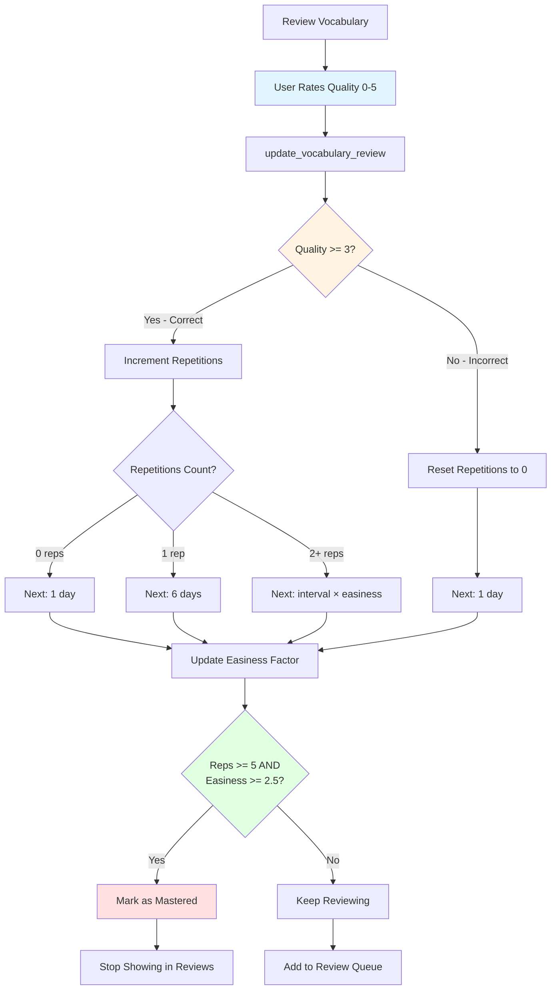
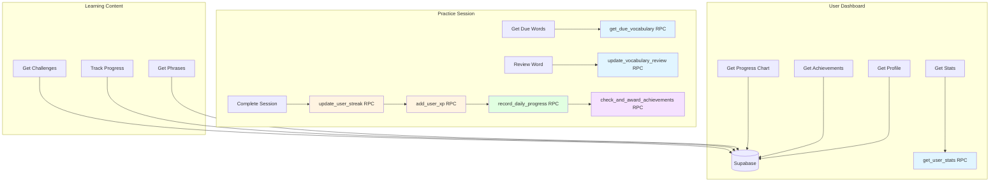
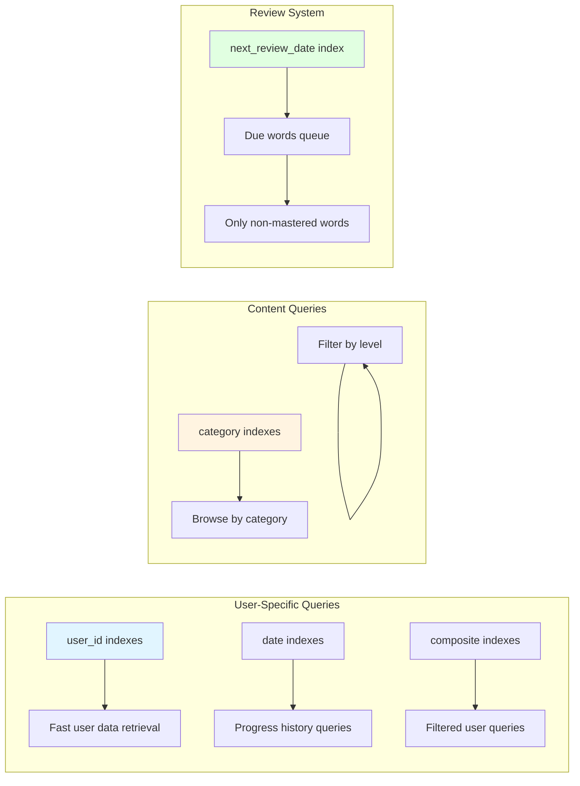
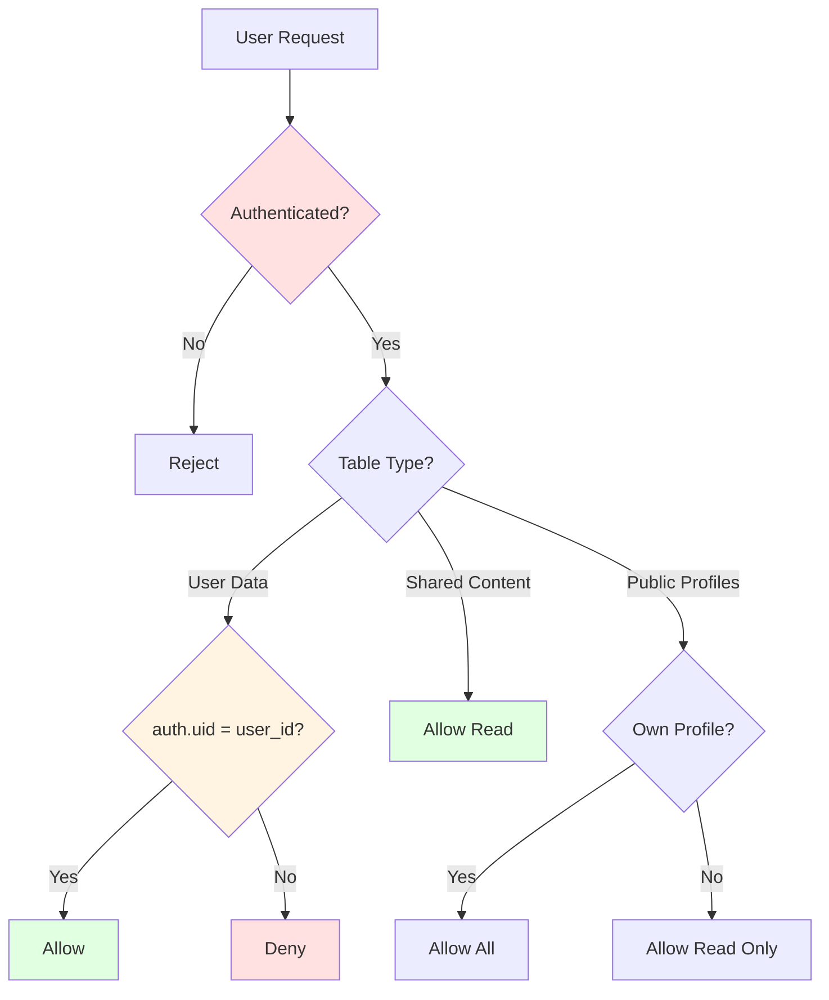

# FastFrench Database Schema Diagram

## Entity Relationship Diagram

```mermaid
erDiagram
    auth_users ||--|| profiles : "has"
    profiles ||--o{ vocabulary : "owns"
    profiles ||--o{ user_phrase_progress : "tracks"
    profiles ||--o{ user_achievements : "earns"
    profiles ||--o{ daily_progress : "records"
    profiles ||--o{ user_challenges : "participates"

    phrases ||--o{ user_phrase_progress : "used-by"
    achievements ||--o{ user_achievements : "awarded-as"
    challenges ||--o{ user_challenges : "assigned-to"

    auth_users {
        uuid id PK
        string email
        timestamp created_at
    }

    profiles {
        uuid id PK "FK->auth.users"
        string display_name
        int current_level "1-50"
        user_rank current_rank "enum"
        int total_xp
        int current_streak
        int longest_streak
        bool streak_freeze_available
        date last_practice_date
        int daily_xp_goal "10|20|50"
        date paris_trip_date "optional"
        int preferred_difficulty "1-5"
        timestamp created_at
        timestamp updated_at
    }

    vocabulary {
        uuid id PK
        uuid user_id FK
        string french_word
        string english_translation
        string phonetic "IPA"
        phrase_category category "enum"
        string example_sentence
        timestamp next_review_date "SM-2"
        decimal easiness_factor "SM-2"
        int repetitions "SM-2"
        int interval "SM-2"
        int times_correct
        int times_incorrect
        bool mastered
        timestamp created_at
        timestamp updated_at
    }

    phrases {
        uuid id PK
        string french_phrase UNIQUE
        string english_translation
        string phonetic "IPA"
        phrase_category category "enum"
        int difficulty "1-5"
        string usage_context
        string audio_url "optional"
        timestamp created_at
    }

    user_phrase_progress {
        uuid id PK
        uuid user_id FK
        uuid phrase_id FK
        int practiced_count
        timestamp last_practiced
        int comfort_level "1-5"
    }

    achievements {
        uuid id PK
        string name UNIQUE
        string description
        string icon_name
        int xp_reward
        requirement_type requirement_type "enum"
        int requirement_value
        timestamp created_at
    }

    user_achievements {
        uuid id PK
        uuid user_id FK
        uuid achievement_id FK
        timestamp earned_at
    }

    daily_progress {
        uuid id PK
        uuid user_id FK
        date date UNIQUE-per-user
        int xp_earned
        int words_learned
        int words_reviewed
        int phrases_practiced
        int time_spent_minutes
        timestamp created_at
    }

    challenges {
        uuid id PK
        challenge_type challenge_type "enum"
        string description
        int xp_reward
        requirement_type requirement_type "enum"
        int requirement_value
        date start_date
        date end_date
        timestamp created_at
    }

    user_challenges {
        uuid id PK
        uuid user_id FK
        uuid challenge_id FK
        int progress
        bool completed
        timestamp completed_at
    }
```

## Custom Types (Enums)



## Key Functions Flow



## Spaced Repetition (SM-2) Flow



## Data Access Patterns



## Index Strategy



## Security Model (RLS)



## Tables Summary

| Table | Type | Purpose | Row Count (Expected) |
|-------|------|---------|---------------------|
| profiles | User Data | User account & gamification | 1 per user |
| vocabulary | User Data | Personal vocabulary list | 100-1000 per user |
| phrases | Shared | Pre-loaded phrase library | ~60 (seeded) |
| user_phrase_progress | User Data | Phrase practice tracking | 0-60 per user |
| achievements | Shared | Achievement definitions | ~60 (seeded) |
| user_achievements | User Data | Earned achievements | 0-60 per user |
| daily_progress | User Data | Daily activity stats | 1 per day per user |
| challenges | Shared | Daily/weekly challenges | ~50 active |
| user_challenges | User Data | Challenge participation | Variable |

## Performance Characteristics

- **Read-Heavy Tables**: phrases, achievements, challenges
  - Cache these on frontend
  - Rarely change after initial seed

- **Write-Heavy Tables**: daily_progress, vocabulary, user_phrase_progress
  - Optimized with indexes
  - Use batch operations where possible

- **Balanced Tables**: profiles, user_achievements, user_challenges
  - Regular reads and periodic writes
  - RPC functions handle complex updates

## Scaling Considerations

1. **Vocabulary Table**: Can grow large (1000+ rows per active user)
   - Indexed on user_id and next_review_date
   - Consider archiving mastered words after long periods

2. **Daily Progress**: Grows continuously
   - One row per user per day
   - Consider aggregating old data monthly

3. **RPC Functions**: Efficient for complex operations
   - Use instead of multiple client-side queries
   - Reduce network round trips

4. **Real-time Subscriptions**: Use sparingly
   - Best for achievements and social features
   - Not needed for most queries
